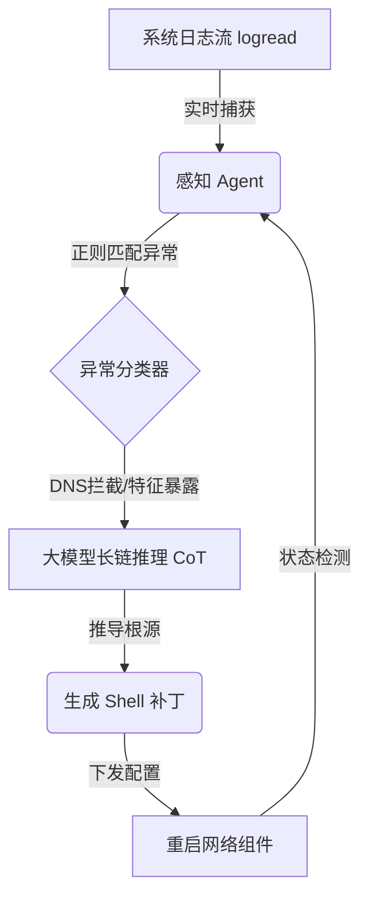

# wrt-agent-core

A lightweight, automated diagnostic Agent designed to run on edge routers (OpenWrt/ImmortalWrt) to resolve network environment anomalies and DPI blocks via LLM long-chain reasoning.

## Core Pain Points
Under restrictive campus network topologies, routing policies encounter dynamic anomalies:
- **DPI Deep Packet Inspection**: Sudden identification updates bypass standard tools, disrupting UA3F/TCP fingerprints.
- **DNS Hijacking**: Standard port 53 traffic is randomly dropped or manipulated.
- **Dynamic IPv6 Invalidation**: Stale routing tables freeze STUN-based port forwarding (Lucky).

## Architectural Flow
1. **Perception**: Hooks into the OpenWrt system log pipe (`logread`).
2. **Reasoning (CoT)**: Correlates distributed failures across SmartDNS, Lucky, and UA3F to deduce gateway firewall status.
3. **Execution**: Extracts exact Shell payloads to modify configs dynamically and trigger service restarts.



## Environment
- **Firmware**: OpenWrt / ImmortalWrt (Kernel 5.15+)
- **Tested Hardware**: MediaTek Filogic 820 platforms (e.g., Xiaomi AX3000T)
- **Dependencies**: Python 3.8+, `requests`


## Installation & Test
```bash


git clone [https://github.com/YOUR_USERNAME/wrt-agent-core.git](https://github.com/YOUR_USERNAME/wrt-agent-core.git)
cd wrt-agent-core
pip install -r requirements.txt

# Run simulation mode
python agent.py
